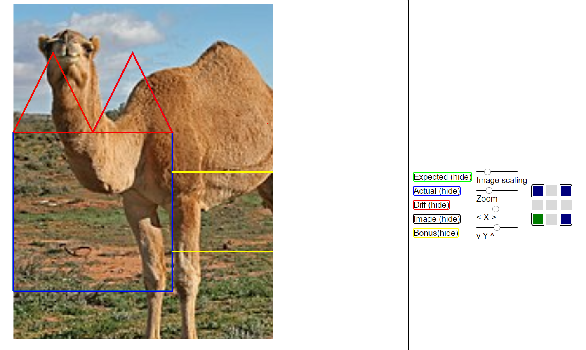
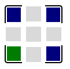

# Contours diff visualization tool

Simple tool to visualize geometrical polygons, optionally on top of an image

## Usage overview

The website consists of two files: [page/index.html](page/index.html) and  the **main.js** build's output (see [below](#build-and-deploy) for build instructions, or get these from a [release](https://github.com/NyuB/layoutdiff/releases).
The site should be able to fetch a 'spec' file specified by url query parameter.
`http://<server>:<port>?specUrl=<mySpec>.json`

Examples of such spec files can be seen under the [page/](page/) folder.

For example, assuming a local server serves a directory on port 7777 with the site and the [camel.jpg](page/camel.jpg) and [camelSpec.json](page/camelSpec.json) files, heading to `http://localhost:7777/?specUrl=camelSpec.json` should load the contours and image corresponding to [camelSpec.json](page/camelSpec.json) in your browser.

```bash
$> mkdir my_server_directory
$> wget -O my_server_directory/index.html https://github.com/NyuB/layoutdiff/releases/download/snapshot/index.html
$> wget -O my_server_directory/main.js https://github.com/NyuB/layoutdiff/releases/download/snapshot/main.js
$> mv camel.jpg my_server_directory/
$> mv camelSpec.json my_server_directory/
$> ls my_server_directory
camel.jpg camelSpec.json index.html main.js
$> python3 -m http.server --directory my_server_directory 7777
Serving HTTP on :: port 7777 (http://[::]:7777/) ...
```



### Note on coordinates referential

All the coordinates (contour and image) are initially assumed to be expressed from the top left corner of the display. You can indicate that the contours are expressed from another corner referential via the dedicated widget.




## Deploy locally from source
+ Build
```bash
make build
```
deploy the site files in [page/](page/)
+ Serve 
```bash
python3 -m http.server --directory page <port>
```
to serve the site under localhost:*port*

## Development

Read the [requirements](#requirements)

### Full pipeline
```bash
make
```
### Test
```bash
make test
```
### Format
```bash
make fmt
```
### Build and deploy
```bash
make build
```
### Requirements

#### To build from source
+ npm (e.g. via [nvm](https://github.com/nvm-sh/nvm))
+ [elm](https://elm-lang.org/) 
```bash
npm install -g elm
```

#### To run tests and formatting

+ elm-format 
```bash
npm install -g elm-format
```
+ elm-test 
```bash
npm install -g elm-test
```
+ [tidy](https://www.html-tidy.org/) 
```bash
<package-manager> install html-tidy
```

#### To deploy and serve

+ Any static file server, e.g [Python3 http.server module](https://docs.python.org/3/library/http.server.html)
